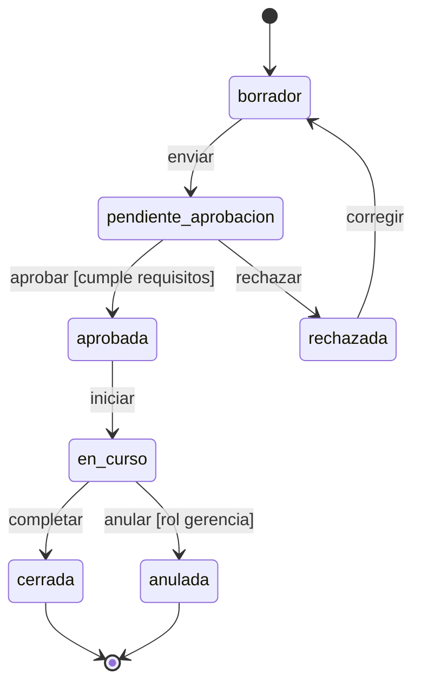

# Patrones de máquinas de estado

Vocabulario y patrones reutilizables para no reinventar estados cada vez. La meta es que dos módulos distintos del mismo ERP usen nombres consistentes cuando el comportamiento es equivalente.

## Vocabulario canónico

Usar estos nombres en `snake_case` salvo que el dominio tenga un término de negocio más preciso.

| Estado | Significado | Es terminal |
|---|---|---|
| `borrador` | Entidad creada pero incompleta/no validada. Editable libremente. | No |
| `pendiente_aprobacion` | Completada; esperando visto bueno de un rol con más permisos. | No |
| `aprobada` / `confirmada` | Validada y lista para ejecutarse. Edición restringida. | No |
| `en_curso` | Ejecutándose (alquiler activo, obra en construcción, factura emitida sin pagar). | No |
| `suspendida` / `pausada` | En pausa temporal por decisión operativa. Puede reanudarse. | No |
| `cerrada` / `completada` | Finalizada normalmente. | Sí |
| `anulada` | Cancelada antes de completarse, por decisión del usuario. | Sí |
| `rechazada` | No aprobada al pasar por `pendiente_aprobacion`. | Sí (o vuelve a `borrador`) |
| `expirada` | Terminó por vencimiento de tiempo sin intervención humana. | Sí |
| `en_revision` | Enviada a un proceso de auditoría interna. | No |
| `en_mantenimiento` | Fuera de operación por mantenimiento (activos, equipos). | No |

Evitar sinónimos arbitrarios (`activo` vs `activa` vs `vigente` vs `habilitada` para lo mismo). Elegir uno y mantenerlo en todo el ERP.

## Patrones típicos

### Patrón 1 — Documento con aprobación

```
borrador → pendiente_aprobacion → aprobada → en_curso → cerrada
                                      ↓
                                  rechazada → borrador
                                      
cualquiera → anulada  (con guarda de rol)
```

Aplica a: facturas, contratos, órdenes de compra, cotizaciones, alquileres, órdenes de trabajo.

### Patrón 2 — Activo físico en operación

```
nueva → disponible → asignada → operando → detenida
                ↑                             ↓
                └──────── en_mantenimiento ───┘
                                
disponible → fuera_de_servicio → dada_de_baja
```

Aplica a: maquinaria, vehículos, herramientas, equipos médicos.

### Patrón 3 — Movimiento transaccional

```
proyectada → ejecutada → conciliada
    ↓
 anulada
```

Aplica a: movimientos contables, transferencias, pagos, ajustes de inventario.

### Patrón 4 — Proceso iterable con vencimiento

```
programada → en_curso → cerrada
                 ↓
              expirada   (por tiempo)
                 ↓
              reabierta → en_curso  (con guarda)
```

Aplica a: mantenimientos preventivos, visitas técnicas, inspecciones, periodos de liquidación.

## Guardas frecuentes (precondiciones)

- **Tiene documentos vigentes** (SOAT, revisión técnica, afiliación SST).
- **Tiene saldo / capacidad suficiente** (inventario, cupo de crédito, horas de operación restantes).
- **El usuario actuante tiene rol autorizado** (ver matriz de roles del módulo).
- **No hay solapamiento con otra asignación** (el mismo recurso en el mismo periodo).
- **El periodo contable está abierto** (no se puede registrar en meses cerrados).
- **Existen aprobaciones previas en cadena** (p. ej. no se puede facturar sin acta firmada).

Registrar siempre la guarda en la tabla de transiciones del `.md` maestro: una transición sin guarda explícita suele esconder un bug latente.

## Cuándo usar sub-estados

Evitar sub-estados si un estado plano alcanza. Usar sub-estados cuando:

- Hay **varios estados paralelos** en la misma entidad (p. ej. una orden puede estar `en_curso` en ejecución + `pendiente_aprobacion` en su addendum). Mermaid `stateDiagram-v2` soporta regiones concurrentes con `--`.
- El estado tiene **fases internas** que interesan al negocio pero no al dominio externo (p. ej. dentro de `en_mantenimiento`: `diagnostico`, `reparacion`, `pruebas`).

Si solo hay una fase interna o se están usando para "más detalle genérico", probablemente no valen la pena.

## Convenciones Mermaid

Siempre `stateDiagram-v2`, dirección vertical (implícita), y:

- Estados terminales marcados con `[*]`.
- Transiciones con el evento arriba y la guarda entre corchetes: `borrador --> aprobada : aprobar [campos completos]`.
- Estados de error con nombre explícito (`rechazada`, `anulada`), nunca con asteriscos o colores.
- Si el diagrama supera ~15 estados, partirlo por sub-entidad.

Ejemplo mínimo:


